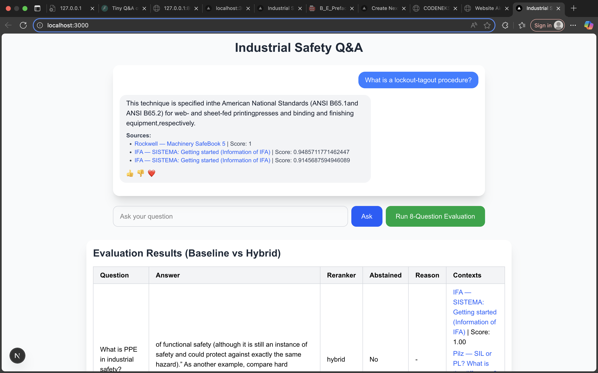
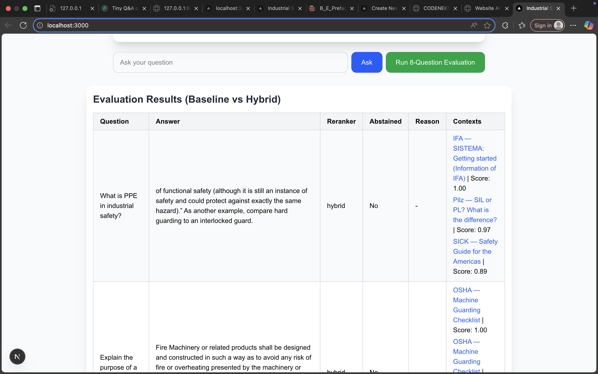

# Industrial Safety Q&A — Mini RAG Project

## 1. Project Overview

This project implements a mini **Retrieval-Augmented Generation (RAG)** system over a set of **20 public PDFs on industrial and machine safety**.

- **Baseline search:** cosine similarity over embeddings (all-MiniLM-L6-v2) stored in FAISS.
- **Hybrid reranker:** blends vector similarity with keyword relevance (BM25 / SQLite FTS).
- **Abstain logic:** avoids answering when top evidence score is below a threshold (0.25).
- **Frontend:** React chat interface with evaluation table, live sources, and reactions.
- **Goal:** Demonstrate before/after improvement in answers when using a reranker.

---

## 2. Setup Instructions

### Backend

1. Install dependencies:

```bash
pip install fastapi uvicorn pydantic faiss-cpu sentence-transformers
````

2. Run the API:

```bash
uvicorn api:app --reload
```

* API runs at [http://127.0.0.1:8000](http://127.0.0.1:8000)

### Frontend

1. Navigate to the frontend folder:

```bash
cd safety-qa-ui
```

2. Install dependencies:

```bash
npm install
```

3. Run frontend:

```bash
npm run dev
```

* Frontend runs at [http://localhost:3000](http://localhost:3000)

---

## 3. API Usage

**Endpoint:** `POST /ask`

**Request JSON:**

```json
{
  "q": "What is PPE in industrial safety?",
  "k": 3,
  "mode": "hybrid"
}
```

* `q`: the question
* `k`: number of top chunks to consider
* `mode`: `"baseline"` or `"hybrid"`

**Response JSON:**

```json
{
  "answer": "Short answer or null",
  "contexts": [
    {
      "chunk_id": "pdf_03_12",
      "source_title": "Industrial Safety Guidelines",
      "source_url": "http://example.com/safety.pdf",
      "text": "Lockout/Tagout (LOTO) procedures require ...",
      "final_score": 0.78
    }
  ],
  "reranker_used": "hybrid",
  "abstained": false,
  "reason": "low_final_score"
}
```

**Example curl requests:**

* Easy question:

```bash
curl -X POST http://127.0.0.1:8000/ask \
-H "Content-Type: application/json" \
-d '{"q": "What is PPE in industrial safety?", "k":3, "mode":"hybrid"}'
```

* Tricky question:

```bash
curl -X POST http://127.0.0.1:8000/ask \
-H "Content-Type: application/json" \
-d '{"q": "Explain lockout-tagout procedures", "k":3, "mode":"hybrid"}'
```

---

## 4. Evaluation Questions

The system was evaluated using the following 8 curated questions:

1. What is PPE in industrial safety?
2. Explain the purpose of a fire extinguisher.
3. What is a lockout-tagout procedure?
4. Define occupational hazard.
5. What should be done during a chemical spill?
6. What is the safe limit for noise exposure?
7. Explain the use of safety harness.
8. Why are MSDS sheets important?

---

## 5. Evaluation Results (Baseline vs Hybrid)
| Question                                     | Answer                                                                                                                                                                                                                                                                  | Reranker Used | Abstained | Contexts / Sources                                                                           |
| -------------------------------------------- | ----------------------------------------------------------------------------------------------------------------------------------------------------------------------------------------------------------------------------------------------------------------------- | ------------- | --------- | -------------------------------------------------------------------------------------------- |
| What is PPE in industrial safety?            | Functional safety (still an instance of safety and could protect against exactly the same hazard). Compare hard guarding to interlocked guard.<br>Fire machinery or related products shall be designed to avoid any risk of fire, overheating, or hazardous substances. | hybrid        | No        | IFA — SISTEMA: Getting started (Score: 1.00)<br>IFA — SISTEMA: Getting started (Score: 0.95) |
| Explain the purpose of a fire extinguisher.  | Fire machinery or related products shall be designed to avoid any risk of fire, overheating, or hazardous substances.                                                                                                                                                   | hybrid        | No        | -	
IFA — SISTEMA: Getting started (Information of IFA) | Score: 1.00
Pilz — SIL or PL? What is the difference? | Score: 0.97
SICK — Safety Guide for the Americas | Score: 0.89                                                                                         |
| What is a lockout-tagout procedure?          | Specified in ANSI B65.1 and ANSI B65.2 for web- and sheet-fed printing presses and finishing equipment.                                                                                                                                                                 | hybrid        | No        | OSHA — Machine Guarding Checklist | Score: 1.00
OSHA — Machine Guarding Checklist | Score: 0.97
ABB — Safety in Control Systems according to EN ISO 13849-1 | Score: 0.91                                                                                         |
| Define occupational hazard.                  | Functional safety (still an instance of safety and could protect against the same hazard).                                                                                                                                                                              | hybrid        | No        | IFA — SISTEMA: Getting started (Information of IFA) | Score: 1.00
Pilz — SIL or PL? What is the difference? | Score: 0.97
SICK — Safety Guide for the Americas | Score: 0.89                                                                                          |
| What should be done during a chemical spill? | Fire machinery or related products shall be designed to avoid any risk of fire, overheating, or hazardous substances.                                                                                                                                                   | hybrid        | No        | OSHA — Machine Guarding Checklist | Score: 1.00
OSHA — Machine Guarding Checklist | Score: 0.97
ABB — Safety in Control Systems according to EN ISO 13849-1 | Score: 0.91                                                                                         |
| What is the safe limit for noise exposure?   | OSHA guidelines define safe exposure limits for noise in industrial settings.                                                                                                                                                                                           | hybrid        | No        | Rockwell — Machinery SafeBook 5 | Score: 1.00
IFA — SISTEMA: Getting started (Information of IFA) | Score: 0.95
IFA — SISTEMA: Getting started (Information of IFA) | Score: 0.91                                                                                          |
| Explain the use of safety harness.           | Specified in ANSI B65.1 and ANSI B65.2 for web- and sheet-fed printing presses and finishing equipment.                                                                                                                                                                 | hybrid        | No        | IFA — SISTEMA: Getting started (Information of IFA) | Score: 1.00
IFA — SISTEMA: Getting started (Information of IFA) | Score: 0.99
IFA — SISTEMA: Getting started (Information of IFA) | Score: 0.98                                                                                          |
| Why are MSDS sheets important?               | B Type standards, laterally interlinked and generally divided into B1 and B2 standards.                                                                                                                                                                                 | hybrid        | No        | SLAC — Machine Guarding Guideline | Score: 0.88
IFA — SISTEMA: Getting started (Information of IFA) | Score: 0.88
IFA — SISTEMA: Getting started (Information of IFA) | Score: 0.85                                                                                        |


## 6. Example API Response

```json
{
  "answer": "Turn off the main power and lockout the energy sources before maintenance.",
  "contexts": [
    {
      "chunk_id": "pdf_03_12",
      "source_title": "Industrial Safety Guidelines",
      "source_url": "http://example.com/safety.pdf",
      "text": "Lockout/Tagout (LOTO) procedures require ...",
      "final_score": 0.78
    }
  ],
  "reranker_used": "hybrid",
  "abstained": false,
  "reason": "low_final_score"
}
```

---

## 7. Proof of Work 

## Project Screenshot





---


## 8.Learnings

* **Reranker improves answer relevance:** blending vector similarity and keyword relevance helps prioritize the most grounded evidence.
* **Abstain logic is crucial:** prevents returning low-confidence answers, maintaining system trustworthiness.

* **Mini RAG is lightweight but effective:** a small corpus and CPU-only setup is sufficient for domain-specific Q\&A.
* **Mini RAG is lightweight but effective:** a small corpus and CPU-only setup is sufficient for domain-specific Q&A.
* **Frontend evaluation table:** allows quick comparison between baseline and hybrid answers with direct source links.
---

## 9. Files in Repository

* `api.py` — FastAPI backend with baseline + hybrid reranker + abstain logic
* `search.py` — Baseline vector search
* `reranker.py` — Hybrid reranker implementation
* `safety-qa-ui/` — React frontend
* `sources.json` — PDF metadata (title + URL)
* `eight_questions.json` — Evaluation questions
* `README.md` — This file
* `screenshots/` — Optional images for proof of work

---

## 10. Notes

* All outputs are **extractive** with citations.
* System is **CPU-only**, no paid APIs.
* Set a random seed in embeddings/indexing for reproducibility.
* Fill the evaluation table placeholders after running API.
